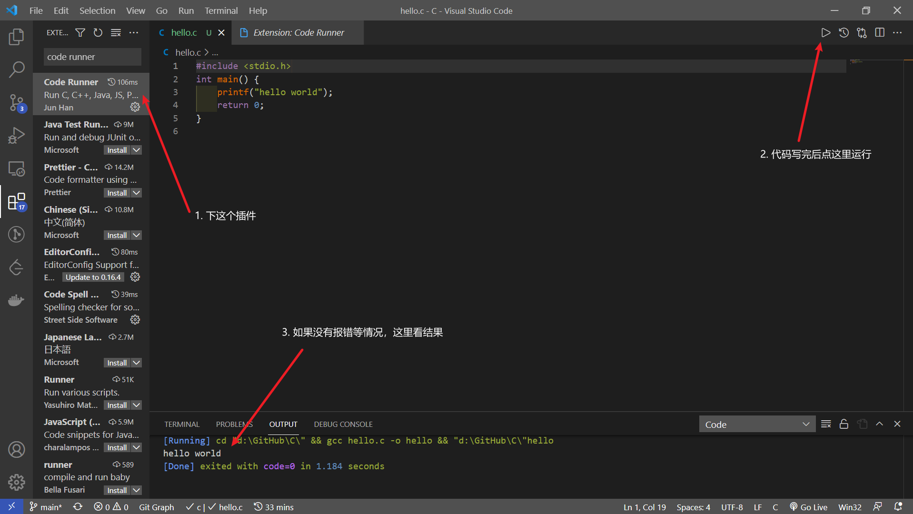
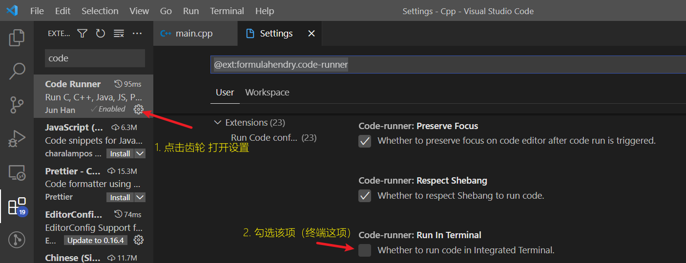

# 仓库介绍
The template of course repository

如果是刚拿到通知书的同学，想学习的话，可以点下面几行的链接

推荐书籍在[这里](guide/README.md#书籍推荐)

> 建议阅读完本页后阅读[下一页](guide/README.md)

## 安装环境

一些常用的软件[镜像站](http://bbs.covariant.cn/d/14)（主要是VSCode）

如果不知道什么是编译器的话，就先直接用[在线的工具](http://www.dooccn.com/cpp/)（有报错，有补全，能输入，比菜鸟的好）

其他一些在线工具的推荐
- 能选择语言标准，指定编译器参数，似乎还能多文件，除了有点慢，看上去都不错:<https://wandbox.org/#language-tab-112>
- 菜鸟的配套工具:<https://www.runoob.com/try/runcode.php?filename=helloworld&type=cpp>

如果有兴趣现在自己电脑装环境的话，就看看下面的内容。

> 先看**注意**，再看教程

比较折腾的VSCode的教程:<https://zhuanlan.zhihu.com/p/87864677>  不想弄可以先跳过
注意点：
1. 看到配置环境的时候，跳过MinGW，然后接入下面的介绍，然后跳过文章的MinGW所有内容，看完安装插件的时候结束
   1. 这时，再安装一个插件： **Code Runner**
   2. 这时候，就可以算是安装完成了
   3. 具体使用下图
2. 如果不知道debug是什么的话，可以先不管debug部分
   1. 包括不限于
   2. Task.json
   3. launch.json
3. MinGW首选安装方式 Release 下载 msi 安装包（要是找不到的话，[点我](https://github.com/SCU-CS/C-Cpp/releases/download/alpha/gcc-10.2.0-mingw-w64-8.0.0-r8-covscript.org.msi)
   1. 一直 next
   2. 该同意点一下的时候点一下就好了
   3. 最后 **install** 等一会就行
   4. 配置环境变量的过程在安装中完成了 **不需要自己配置环境变量**
4. MinGW也可以在这里[下载](http://mirrors.covariant.cn/software/x86_64-8.1.0-release-posix-seh-rt_v6-rev0.7z)（也可以加群手把手教安装）
   1. 这个需要手动配置环境变量
   2. 主要是这个下得快

如何让代码跑起来的演示图

解决code runner不能输入的问题

### Windows

如果知道什么是编译器的话，下载 release 的那个msi，直接安装就好了

如果有OI经验，想尝鲜的，可以看看Dev-C++的[6.x版本](https://github.com/Embarcadero/Dev-Cpp/releases)

如果纯小白的话，有三个选择：
1. 上面链接的VSCode
2. Visual Studio
   1. 搜索，然后在官网下载免费的社区版
   2. 下载完成后再下 C++ 相关的东西就行了
3. [Dev-Cpp](https://devcpp.gitee.io/)或者[Code::Block](https://www.codeblocks.org/downloads/binaries)
   1. Dev的安装教程:<http://c.biancheng.net/cpp/html/3389.html>
   2. 使用指南:<https://zhuanlan.zhihu.com/p/259191634>

### Linux

~~你都用Linux了，不会不知道怎么用包管理器下东西吧~~

几个选择：
1. VSCode+gcc/clang
2. Vim+gcc/clang
3. Emacs+gcc/clang
4. Code::Blocks

### macOS

似乎得装Xcode

下面的教程都是用的VSCode和Xcode

- 极简教程:<https://zhuanlan.zhihu.com/p/158566155>
- 详细一点的:<https://juejin.cn/post/6844904088446959629>

## 免责

***商用禁止*** 大多数资料都是24小时学习版，除了写明了具体获取路径和同学们自制自主上传的文件。

- 仓库中所有文件，若侵，联系确认后立删
- 著作权只属于文件作者
- 拒绝未经允许的使用、分发、传播